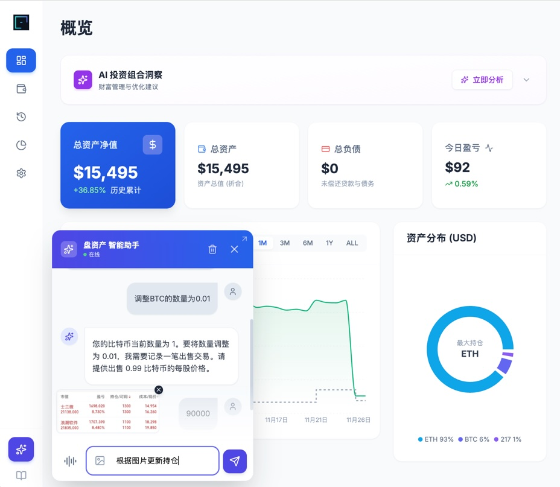

# PanassetLite (盘资产·轻)

<div align="center">

[](https://kuka36.github.io/PanassetLite/)
[](https://opensource.org/licenses/MIT)
<br/>


**一款由人工智能驱动、Local-First 保证主权数据和强大的可视化功能的现代个人金融系统。**
<br/>
---

<p align="left">
这是“零门槛、无需注册、本地数据”的版本。<br/>
它的精神是：<strong>轻松、智能地帮您管理资产</strong>。
</p>

</div>

## 📸 系统截图 (Screenshots)



> *仪表盘概览 - 实时掌握净值动态与资产分布*  
> *智能助手 - 接管您一切操作*

---

## ✨ 核心特性 (Key Features)

- **💎 全资产覆盖**  
  支持股票 (Stock)、加密货币 (Crypto)、基金 (Fund)、房地产 (Real Estate)、现金 (Cash) 及负债 (Liability) 管理。

- **🛡️ 隐私至上 (Local First)**  
  无需注册，数据完全加密存储在您的本地浏览器 (LocalStorage)，确保财务隐私绝对安全。

- **🧠 AI 智能顾问 (Dual Engine)**  
  所有操作可通过自然语言对话完成，并为您提供专业的投资组合风险评估、财富健康检查与优化建议。

- **📈 实时行情**  
  自动对接 Alpha Vantage (股票) 和 CoinGecko (加密货币) API，实时更新资产现值。

- **💱 多币种自动折算**  
  内置实时汇率引擎，支持 USD, CNY, HKD 等多币种资产自动折算为统一基准货币展示。

- **📊 强大的可视化**  
  提供净值走势图、资产配置饼图、盈亏排行等多种交互式图表。

---

## 🛠️ 技术栈 (Tech Stack)

*   **Frontend**: React 19, TypeScript, Vite
*   **Styling**: Tailwind CSS, Lucide Icons
*   **Visualization**: Recharts
*   **AI Integration**: Google Gemini API, DeepSeek API, Alibaba Qwen API
*   **Market Data**: Alpha Vantage API, CoinGecko API

---

## 🚀 快速开始 (Run Locally)

**前置要求**: Node.js 18+

1.  **克隆项目**
    ```bash
    git clone https://github.com/kuka36/PanassetLite.git
    cd PanassetLite
    ```

2.  **安装依赖**
    ```bash
    npm install
    ```

3.  **启动开发服务器**
    ```bash
    npm run dev
    ```
    打开浏览器访问 `http://localhost:3000` 即可使用。

4.  **构建部署**
    ```bash
    npm run build
    ```

---

## ⚙️ API 配置 (Optional)

为了获得完整的 AI 分析与实时股价体验，建议在应用的 **设置 (Settings)** 页面配置以下 Key（均为免费申请）：

1.  **AI 智能顾问**:
    *   **Google Gemini API Key**: ([申请链接](https://aistudio.google.com/app/apikey))
    *   **DeepSeek API Key**: ([申请链接](https://platform.deepseek.com/api_keys))
    *   **Qwen API Key**: 通义千问 API Key ([申请链接](https://bailian.console.aliyun.com/?#/api-key))
2.  **Alpha Vantage API Key**: 用于美股/港股实时价格。 ([申请链接](https://www.alphavantage.co/support/#api-key))

*注：若不配置 API Key，应用仍可完美支持手动记账与资产统计功能。*

---

## 📄 License

MIT License © 2025 PanassetLite